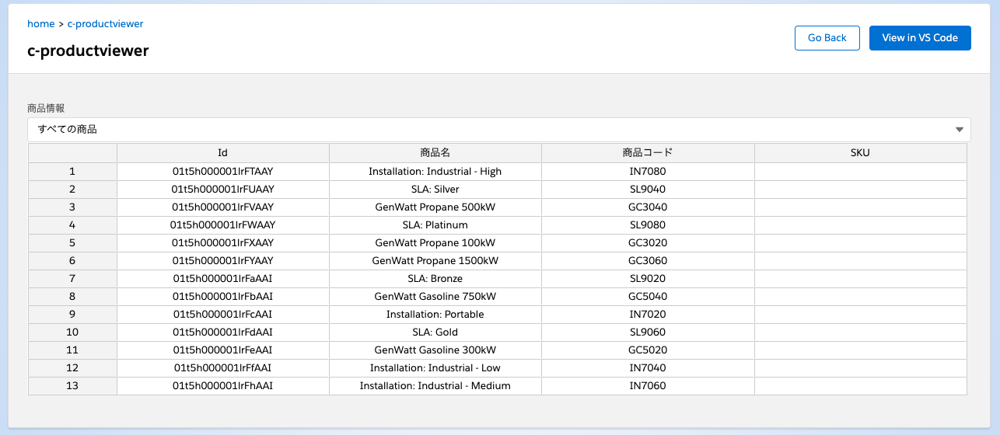

# Salesforceでスプレッドシートっぽい表示をするサンプル

## 使用ライブラリ

- Jspreadsheet CE v4
  - https://github.com/jspreadsheet/ce
- jSuites v4
  - https://github.com/jspreadsheet/ce

## スクリーンショット

## 解説

- https://salesforce-dev-notes.com/posts/2021/08/29/3rd-party-library/
- https://salesforce-dev-notes.com/posts/2021/09/05/3rd-party-library-part2/
- https://salesforce-dev-notes.com/posts/2021/09/12/apex-listview/

